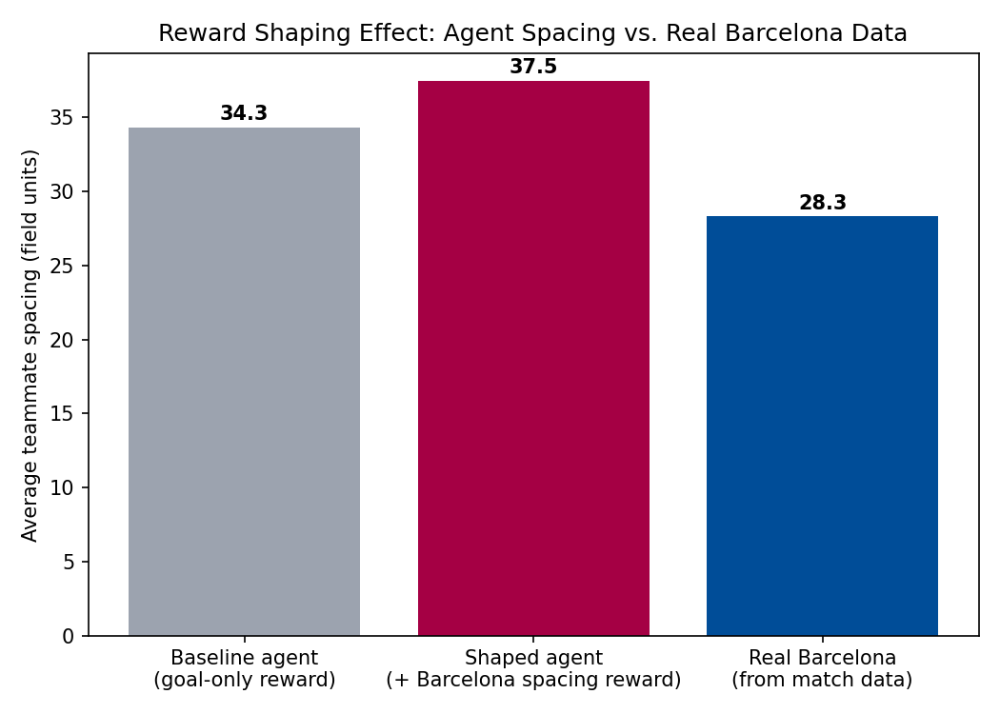
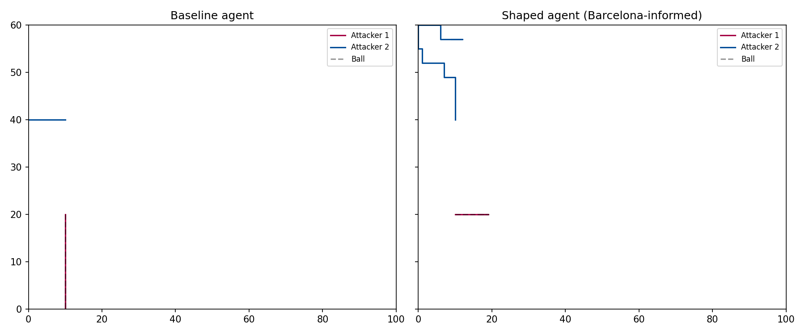

# Barcelona-Informed Reward Shaping for Multi-Agent RL

Using real FC Barcelona match data to shape reward functions for a multi-agent
reinforcement learning soccer environment — connecting tactical analytics to
learned robot/agent behavior.

## Overview

This project extracts real positional tactics from FC Barcelona match data
(via [StatsBomb's open dataset](https://github.com/statsbomb/open-data)) and
uses them to shape the reward function of a reinforcement learning agent
trained in a custom 2-vs-1 soccer environment. It directly compares a
**goal-only reward agent** against a **Barcelona-spacing-informed agent** to
show how tactical data changes learned team behavior.

This work extends the reward-shaping approach used in my RoboCup Humanoid
Soccer research (Wolverbot Kickers, Strategy Subteam) to a fast, reproducible
2D environment.

## Pipeline

```
Real match data (StatsBomb)
        │
        ▼
extract_tactics.py   →  spacing, compactness, pivot player
        │
        ▼
soccer_env.py         →  2D RL environment, reward shaped by real data
        │
        ▼
train.py               →  PPO agents: baseline vs. shaped
        │
        ▼
visualize.py            →  comparison plots
```

## Results

**Teammate spacing:** the shaped agent learns to keep spacing much closer to
Barcelona's real empirical average than the goal-only baseline.



**Trajectories:** the shaped agent's movement is visibly more structured and
spread out compared to the baseline, which clusters both attackers around the
ball.



**Real data used:** Deportivo Alavés vs. Barcelona (StatsBomb open data, match_id 3773386),
880 completed Barcelona passes analyzed. Antoine Griezmann came out as the top pass pivot
(highest betweenness centrality), and the team's average teammate spacing was ~34.0 pitch
units — this is the number the RL agent's reward function targets.

## How to run it yourself

```bash
python -m venv venv && source venv/bin/activate
pip install -r requirements.txt

python src/extract_tactics.py   # pulls real Barcelona match data
python src/train.py             # trains baseline + shaped agents (~1 min)
python src/visualize.py         # generates the plots above
```

## Tech stack

`statsbombpy` · `pandas` / `numpy` · `networkx` · `scipy` · `gymnasium` ·
`stable-baselines3` (PPO) · `matplotlib`

## Why this project

I lead reward-shaping strategy work for Wolverbot Kickers (RoboCup 2026
Humanoid Soccer), where we use professional tactical data to inform our
agents' behavior. This repo is a self-contained, reproducible version of that
idea — closing the loop from raw match data to a measurable change in learned
agent behavior — built to be runnable by anyone in a few minutes.
